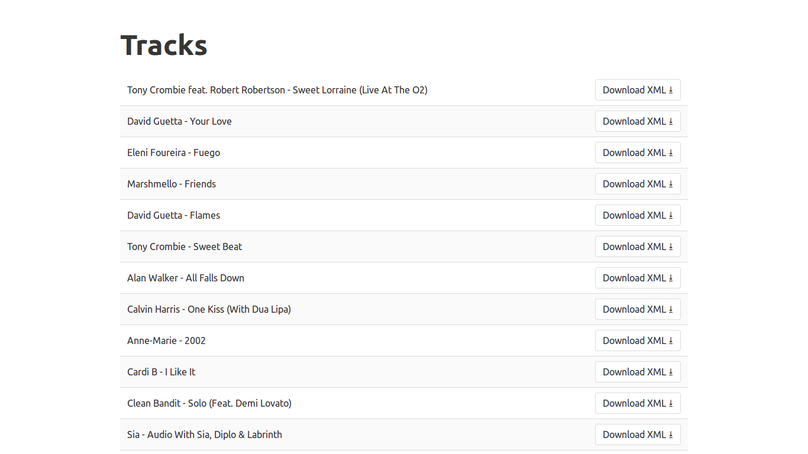

# Beatroot XML Downloader

Builds and downloads custom XML files using track data from Beatroot's API.

## Built With

- Rails 5.2.1
- Ruby 2.5.3
- RSpec
- [HTTParty](https://github.com/jnunemaker/httparty)
- [Equivalent XML](https://github.com/mbklein/equivalent-xml)
- [Beatroot API](http://beatroot.com/)

See the [Gemfile](Gemfile) for more information.

## Screenshot

<kbd>
  
</kbd>
